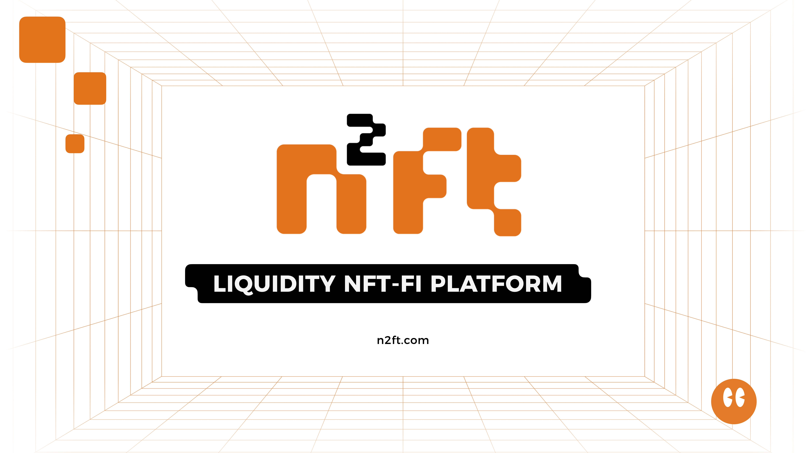

# N2FT Introduction

N2FT, a leading NFT Aggregator and NFTFi platform, is poised to redefine the world of Non-Fungible Tokens (NFTs) with its innovative approach to enhancing liquidity and embedded value. With its groundbreaking features and strategic collaborations, N2FT is set to revolutionize the NFT landscape like never before.

# Installation Guide

To install N2FT, follow these steps:

1. Clone the repository:
    ```
    git clone https://github.com/n2ft-web.git
    ```

2. Navigate to the project directory:
    ```
    cd n2ft-web
    ```

3. Install the dependencies & build the project:
    ```
    yarn && yarn typechain:build
    ```

4. Start the application:
    ```
    yarn dev
    ```

5. Open your browser and visit `http://localhost:8000` to access N2FT.

That's it! You have successfully installed N2FT and can now start exploring its features.